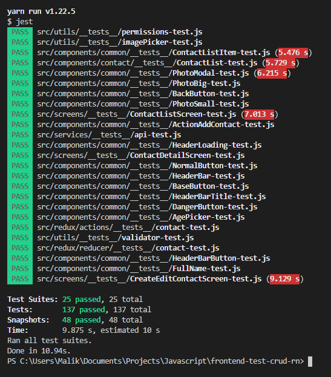

# Frontend React Native Test

## Test Results

## Frameworks

- react-native (android)

## APK Link

- https://drive.google.com/file/d/1G-nHr_L_izhFjJs75fAzZcXSIWLA1ufa/view?usp=sharing

## yarn install

Install all needed packages

## yarn test

Test components, api, redux and snapshots

## yarn lint

Check typing

## reference

- https://altany.github.io/react-native/0.61/jest/mocking/upgrade/2020/01/25/mocking-react-native-0.61-modules-with-jest.html
- https://stackoverflow.com/questions/60115885/how-to-solve-the-update-was-not-wrapped-in-act-warning-in-testing-library-re
- https://medium.com/@dariaruckaolszaska/testing-your-react-navigation-5-hooks-b8b8f745e5b6
- https://github.com/facebook/react-native/issues/26579
- https://github.com/jasmine/jasmine/issues/1443
- https://github.com/sapegin/jest-cheat-sheet
- https://www.benmvp.com/blog/asynchronous-testing-with-enzyme-react-jest/